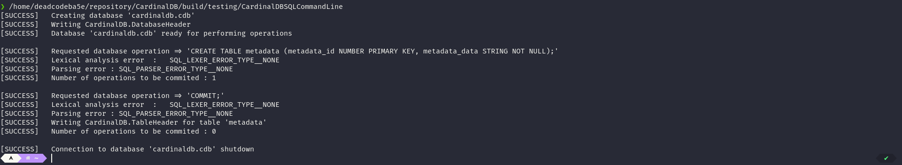
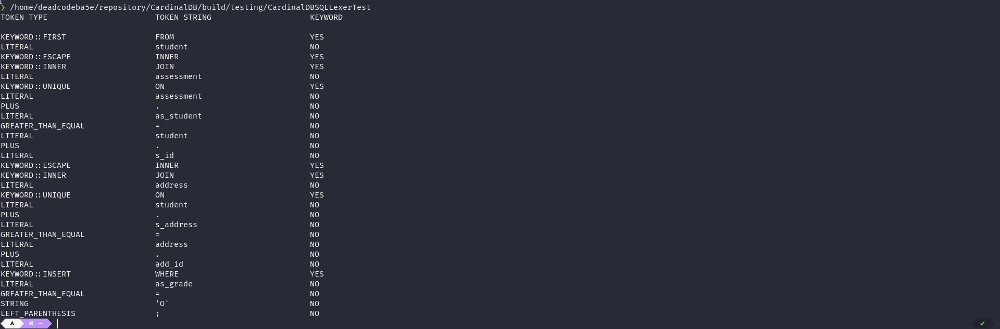
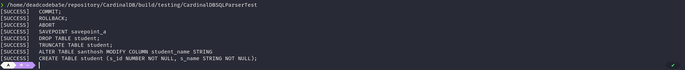

#   CardinalDB
##  Introduction
CardinalDB is an embeddeable database management system written in C11

##  Roadmap
- [x] Implement Lexer routines
- [x] Implement Parser routines
- [ ] Implement Language features
    + [x] Implement SQL - Basic DDL statements
    + [ ] Implement SQL - Basic DML statements
    + [ ] Implement SQL - Advanced DDL statements
    + [ ] Implement SQL - Advanced DML statements
    + [x] Implement SQL - TCL statements

##  Screenshots

##  License
This project is licensed under [BSD 3-Clause License](https://opensource.org/licenses/BSD-3-Clause)